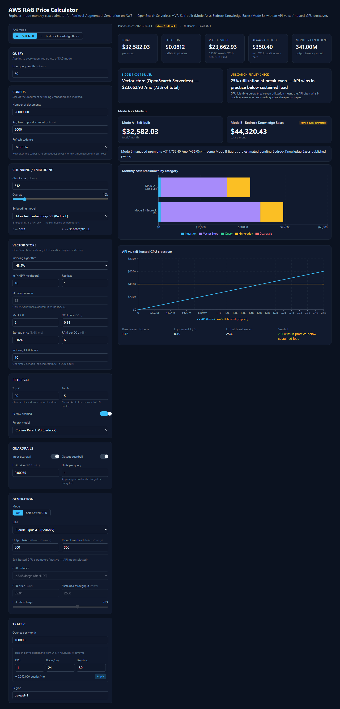

# AWS RAG Price Calculator

Engineer-mode cost estimator for Retrieval-Augmented-Generation (RAG) pipelines on AWS — model the full pipeline from ingestion through generation and see your monthly bill update live.



[](https://vercel.com/new/clone?repository-url=https://github.com/USER/rag-cost-calculator)

**Live demo:** Vercel — `https://rag-cost-calculator.vercel.app` (replace with your deployment URL) · GitHub Pages — `https://USER.github.io/rag-cost-calculator/` (replace `USER` with your GitHub username)

## Quickstart

```bash
npm install
npm run dev
npm test
```

Open [http://localhost:3000](http://localhost:3000).

## Build modes

This app builds in two distinct modes, both from the same source:

| Command | Target | Pricing | Notes |
|---|---|---|---|
| `npm run build` | Vercel (or any Node host) | Live, via `/api/prices` | Needs `AWS_ACCESS_KEY_ID` / `AWS_SECRET_ACCESS_KEY` env vars. Falls back to `public/prices.json` if AWS is unreachable. |
| `npm run build:static` | GitHub Pages (or any static host) | `public/prices.json` only | Sets `STATIC_EXPORT=true`, which flips `next.config.mjs` to `output: "export"` and emits a fully static bundle to `./out`. No server runtime, no `/api` route. |

For static hosting under a repo subpath (e.g. `https://USER.github.io/rag-cost-calculator/`), set `NEXT_PUBLIC_BASE_PATH=/rag-cost-calculator` so `basePath`/`assetPrefix` resolve correctly — see `.env.example`.

```bash
npm run build:static
npm run serve:static   # preview the static export locally on :3100
```

## Hosting

- **Primary — Vercel.** Deploy with the button above, then set `AWS_ACCESS_KEY_ID` and `AWS_SECRET_ACCESS_KEY` (and optionally `AWS_REGION`) as Vercel project environment variables so `/api/prices` returns live AWS pricing.
- **Fallback — GitHub Pages.** Fully static; pricing comes from the committed `public/prices.json`, refreshed nightly by a scheduled workflow. No AWS credentials required to host or run it.
- **Also compatible with Cloudflare Pages** (or any static host) using the same `npm run build:static` output.

The app is **100% client-side** — every calculation runs in the browser. Live AWS pricing is a nice-to-have enhancement, not a requirement: with zero backend and zero credentials, the calculator is fully usable from the committed fallback prices.

### Setting up the AWS IAM credential (optional, for live pricing)

Create an IAM user (or role) with a policy scoped to read-only pricing lookups — nothing else:

```json
{
  "Version": "2012-10-17",
  "Statement": [
    {
      "Effect": "Allow",
      "Action": "pricing:GetProducts",
      "Resource": "*"
    }
  ]
}
```

Generate an access key for that user, then add the credentials in **both** places that need them:

1. **Vercel** — Project Settings → Environment Variables: `AWS_ACCESS_KEY_ID`, `AWS_SECRET_ACCESS_KEY`, `AWS_REGION`.
2. **GitHub Actions** — repo Settings → Secrets and variables → Actions: `AWS_ACCESS_KEY_ID`, `AWS_SECRET_ACCESS_KEY`, `AWS_REGION` (used by the nightly `refresh-prices` workflow).

**Never commit real credentials.** `.env` and `.env*.local` are gitignored; only reference secrets via `${{ secrets.* }}` in workflows or the Vercel dashboard.

## Cost model assumptions

The engine (`lib/calc-engine.ts`) is a pure, deterministic function of your inputs and the current price book — no hidden state.

- **Ingestion.** Corpus tokens are chunked (`chunkSize`, minus overlap) into vectors, each embedded once. The one-time embed cost is amortized monthly based on refresh cadence (one-time / weekly / monthly).
- **Vector store (OpenSearch Serverless).** RAM is estimated from the HNSW graph: `RAM = 1.1 * (4*dim + 8*m) * N * (1 + replicas)`. Switching to `ivf_pq` divides that by the PQ compression factor; `ivf_fp16` halves it. RAM maps to OCUs (~6 GB RAM/OCU), billed at the OCU-hour rate plus raw vector storage.
- **Per-query cost.** Sums optional input guardrails, query embedding, optional reranking, LLM generation (retrieved-chunk context + prompt overhead + output tokens), and optional output guardrails.
- **Generation: API vs. self-hosted GPU crossover.** Compares linear per-token API pricing against a self-hosted GPU box's fixed hourly cost, including an honesty check on utilization at the break-even point — if break-even requires implausibly low utilization, the model flags that self-hosting isn't actually cheaper in practice at that volume.
- **Mode A vs. Mode B.** Mode A is a self-built pipeline (your choice of index algorithm, replicas, generation mode). Mode B simulates Bedrock Knowledge Bases as a managed service (HNSW-only, redundant OCUs, API-only generation), so the managed-service premium shows up naturally in the total.

Prices are **live-with-fallback**: the app tries the live AWS Price List API first, falls back to the committed `public/prices.json`, and shows a "prices as of `<date>`" note with a stale-data indicator when running from the fallback. Some Mode B (Bedrock Knowledge Bases) figures are **estimated**, since AWS does not expose all managed-service internals via the pricing API.

### Reference price anchors (us-east-1, on-demand)

| Resource | Price |
|---|---|
| `p5.48xlarge` (8x H100) | ~$55.04/hr |
| `p5e.48xlarge` (8x H200) | ~$47.76/hr |
| `p4d.24xlarge` (8x A100) | ~$32.77/hr |
| OpenSearch Serverless OCU | ~$0.24/OCU-hr |
| OpenSearch Serverless storage | ~$0.024/GB-mo |
| OpenSearch Serverless RAM | ~6 GB per OCU |

## Scripts

| Script | What it does |
|---|---|
| `npm run dev` | Local dev server |
| `npm run build` | Production build with live `/api/prices` (Vercel) |
| `npm run build:static` | Static export to `./out` (GitHub Pages / Cloudflare Pages) |
| `npm test` | Run the test suite (Vitest) |
| `npm run typecheck` | `tsc --noEmit` |
| `npm run refresh-prices` | Refresh `public/prices.json` from the AWS Price List API |
| `npm run serve:static` | Serve `./out` locally to preview the static build |

## License

[MIT](LICENSE)
